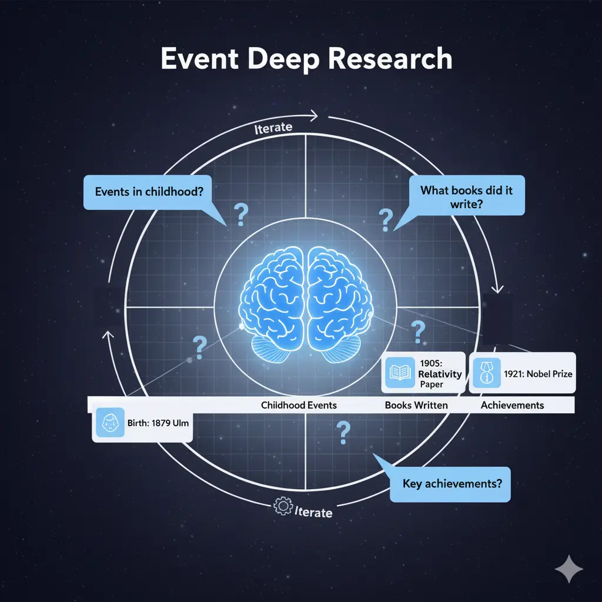

[![Contributors][contributors-shield]][contributors-url]
[![Forks][forks-shield]][forks-url]
[![Stargazers][stars-shield]][stars-url]
[![Issues][issues-shield]][issues-url]
[![Unlicense License][license-shield]][license-url]
[![LinkedIn][linkedin-shield]][linkedin-url]

# Event Deep Research

AI Agent that researchs the lifes of historical figures and extracts the events into a structured JSON timeline.



## Table of Contents

- [Event Deep Research](#event-deep-research)
  - [Table of Contents](#table-of-contents)
  - [Features](#features)
  - [Demo / Example](#demo--example)
  - [🚀 Installation](#-installation)
    - [Prerequisites](#prerequisites)
    - [Setup](#setup)
  - [Usage](#usage)
    - [Via LangGraph Studio (Recommended)](#via-langgraph-studio-recommended)
  - [Configuration (configuration.py)](#configuration-configurationpy)
  - [Architecture / Internals](#architecture--internals)
  - [Roadmap / Future Work](#roadmap--future-work)
  - [Contributing](#contributing)
  - [License](#license)
  - [Acknowledgments](#acknowledgments)

---

## Features

- Supervisor Agent with multiple tools (Research, think, Finish)
- Merge Workflow to incorporate and deduplicate events from multiple sources
- Support for OpenAI, Anthropic, Google, or Local models (Ollama)

## Demo / Example

https://github.com/user-attachments/assets/ebda1625-fdf6-4f3b-a5d2-319d6db40ec2

**Input:**

```json
{
  "person_to_research": "Albert Einstein"
}
```

**Output:**

```json
{
  "structured_events": [
    {
      "name": "Birth in Ulm",
      "description": "Albert Einstein was born in Ulm, Germany to Hermann and Pauline Einstein",
      "date": {"year": 1879, "note": "March 14"},
      "location": "Ulm, German Empire",
      "id": "time-1879-03-14T00:00:00Z"
    },
    {
      "name": "Zurich Polytechnic",
      "description": "Entered the Swiss Federal Polytechnic School in Zurich to study physics and mathematics",
      "date": {"year": 1896, "note": ""},
      "location": "Zurich, Switzerland",
      "id": "time-1896-01-01T00:00:00Z"
    },
    {
      "name": "Miracle Year Papers",
      "description": "Published four groundbreaking papers on photoelectric effect, Brownian motion, special relativity, and mass-energy equivalence",
      "date": {"year": 1905, "note": ""},
      "location": "Bern, Switzerland",
      "id": "time-1905-01-01T00:00:00Z"
    },
    {
      "name": "Nobel Prize in Physics",
      "description": "Awarded Nobel Prize for his discovery of the law of the photoelectric effect",
      "date": {"year": 1921, "note": ""},
      "location": "Stockholm, Sweden",
      "id": "time-1921-01-01T00:00:00Z"
    },
    {
      "name": "Death in Princeton",
      "description": "Albert Einstein died at Princeton Hospital after refusing surgery for an abdominal aortic aneurysm",
      "date": {"year": 1955, "note": "April 18"},
      "location": "Princeton, New Jersey, USA",
      "id": "time-1955-04-18T00:00:00Z"
    }
  ]
}
```

## 🚀 Installation

### Prerequisites

- **Python 3.12+**
- **uv** (Python package manager)

### Setup

```bash
# 1. Clone the repository
git clone https://github.com/bernatsampera/event-deep-research.git
cd event-deep-research

# 2. Create virtual environment and install dependencies
uv venv && source .venv/bin/activate
uv sync

# 3. Set up environment variables
cp .env.example .env
# Edit .env with your API keys:
# FIRECRAWL_BASE_URL  (https://api.firecrawl.com/v1)
# - FIRECRAWL_API_KEY (required for production, optional for local testing)
# - TAVILY_API_KEY (required)
# - OPENAI_API_KEY, ANTHROPIC_API_KEY, or GOOGLE_API_KEY (Change model in configuration.py)

# 4. Start the development server
uvx --refresh --from "langgraph-cli[inmem]" --with-editable . --python 3.12 langgraph dev --allow-blocking
# Open http://localhost:2024 to access LangGraph Studio
```

## Usage

### Via LangGraph Studio (Recommended)

1. Start the development server: `uvx --refresh --from "langgraph-cli[inmem]" --with-editable . --python 3.12 langgraph dev --allow-blocking`
2. Open http://localhost:2024
3. Select the `supervisor` graph
4. Input your research query:
   ```json
   {
     "person_to_research": "Albert Einstein"
   }
   ```
5. Watch the agent work in real-time!

## Configuration (configuration.py)

    llm_model: Primary LLM model to use for both structured output and tools

    # Optional overrides to change the models used for different parts of the workflow
    structured_llm_model: Override model for structured output
    tools_llm_model: Override model for tools
    chunk_llm_model: Small model for chunk biographical event detection

    # Maximum tokens for the models
    structured_llm_max_tokens: Maximum tokens for structured output model
    tools_llm_max_tokens: Maximum tokens for tools model

    # Maximum retry attempts for the models
    max_structured_output_retries: Maximum retry attempts for structured output
    max_tools_output_retries: Maximum retry attempts for tool calls

    # Values from graph files
    default_chunk_size: Default chunk size for text processing
    default_overlap_size: Default overlap size between chunks
    max_content_length: Maximum content length to process
    max_tool_iterations: Maximum number of tool iterations
    max_chunks: Maximum number of chunks to process for biographical event detection

## Architecture / Internals

1. **Supervisor Agent** - Coordinates the entire workflow, decides next steps
2. **Research Agent** - Finds relevant biographical sources, manages crawler and merge agents
3. **URL Crawler** - Extracts content from web pages with Firecrawl
4. **Merge Agent** - Combines and deduplicates events


## Roadmap / Future Work

- Add images to relevant events
- Improve speed of merge graph

## Contributing

We welcome contributions! This is a great project to learn:

1. **Fork** the repository
2. **Create** a feature branch: `git checkout -b feature/amazing-feature`
3. **Commit** your changes: `git commit -m 'Add amazing feature'`
4. **Push** to the branch: `git push origin feature/amazing-feature`
5. **Open** a Pull Request

See the [open issues](https://github.com/bernatsampera/event-deep-research/issues) for a full list of proposed features and known issues.

## License

Distributed under the MIT License. See `LICENSE.txt` for details.

## Acknowledgments

- **[LangChain](https://github.com/langchain-ai/langchain)** - Foundational LLM framework
- **[LangGraph](https://github.com/langchain-ai/langgraph)** - Multi-agent orchestration
- **[Open Deep Research](https://github.com/langchain-ai/open_deep_research)** - Research methodology inspiration
- **[Firecrawl](https://www.firecrawl.com/)** - Web scraping
- **[Tavily](https://tavily.ai/)** - Web search

[contributors-shield]: https://img.shields.io/github/contributors/bernatsampera/event-deep-research.svg?style=for-the-badge
[contributors-url]: https://github.com/bernatsampera/event-deep-research/graphs/contributors
[forks-shield]: https://img.shields.io/github/forks/bernatsampera/event-deep-research.svg?style=for-the-badge
[forks-url]: https://github.com/bernatsampera/event-deep-research/network/members
[stars-shield]: https://img.shields.io/github/stars/bernatsampera/event-deep-research.svg?style=for-the-badge
[stars-url]: https://github.com/bernatsampera/event-deep-research/stargazers
[issues-shield]: https://img.shields.io/github/issues/bernatsampera/event-deep-research.svg?style=for-the-badge
[issues-url]: https://github.com/bernatsampera/event-deep-research/issues
[license-shield]: https://img.shields.io/github/license/bernatsampera/event-deep-research.svg?style=for-the-badge
[license-url]: https://github.com/bernatsampera/event-deep-research/blob/master/LICENSE.txt
[linkedin-shield]: https://img.shields.io/badge/-LinkedIn-black.svg?style=for-the-badge&logo=linkedin&colorB=555
[linkedin-url]: https://www.linkedin.com/in/bernat-sampera-195152107/
